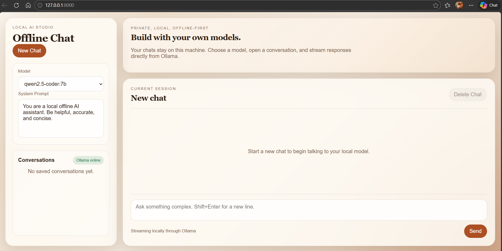

# Offline Ollama Chatbot

A full-stack local chatbot built with Python, FastAPI, SQLite, and a browser UI that streams responses from your offline Ollama models.

## Chatbot UI



## Features

- Fully local backend in Python
- Offline browser UI with chat history
- Streaming responses from Ollama
- Conversation sidebar with saved sessions
- Model picker and editable system prompt
- SQLite persistence for chats

## Tech Stack

- Python
- FastAPI
- Ollama
- Qwen2.5 LLM
- SQLite
- HTML / CSS / JavaScript

## Run It

1. Install Python dependencies:

```powershell
pip install -r requirements.txt
```

2. Make sure Ollama is running and you have at least one model installed:

```powershell
ollama list
```

3. Start the app:

```powershell
uvicorn app:app --reload
```

4. Open:

```text
http://127.0.0.1:8000
```

## Current Default Model

This project defaults to `qwen2.5-coder:7b`, but the UI will automatically load any models available in your local Ollama instance.

## Project Structure

```text
app.py
requirements.txt
templates/index.html
static/styles.css
static/app.js
data/chatbot.db   # created automatically on first run
```